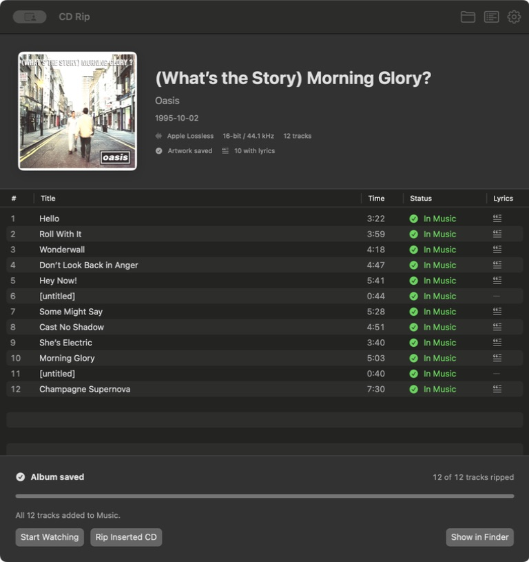

# CD Rip

A native macOS app for ripping CDs to ALAC, AAC, FLAC or WAV, with artwork, lyrics
and optional Music import.



## Build the app

Early preview. Currently distributed as source, not a notarized download.
Requires macOS 13+, Xcode Command Line Tools, Python 3.11+ and Homebrew.
The bundled Python runtime must also support your target macOS version.

```sh
brew install ffmpeg libdiscid libcdio-paranoia
git clone https://github.com/clem109/cd-rip.git
cd cd-rip
python3 -m venv .venv
.venv/bin/python -m pip install -e '.[mac]'
.venv/bin/python mac/build.py
open 'dist/CD Rip.app'
```

In Music, set **When a CD is inserted → Show CD**. Click **Start Watching**, then
insert a disc, or **Rip Inserted CD** for one already in the drive. Choose the
matching edition when prompted. Completed discs eject automatically.

## Formats

| Format | Quality | Music import |
| --- | --- | --- |
| Apple Lossless (default) | Lossless · `.m4a` | Yes |
| AAC | 128–320 kbps · `.m4a` | Yes |
| FLAC | Lossless · `.flac` | No |
| WAV | Uncompressed · `.wav` | Yes; metadata support varies |

Choose the format and AAC quality in **Settings**. Artwork and available lyrics
download during ripping. The default archive is `~/Music/CD Rip/`.

Lossless output is checked against the extracted PCM. AAC is checked for decoding,
duration and audio format, not bit-perfect identity. Read correction uses
`cd-paranoia`; AccurateRip verification is not implemented.

## CLI

```sh
.venv/bin/cd-rip doctor
.venv/bin/cd-rip watch
.venv/bin/cd-rip rip --format aac --aac-bitrate 256
.venv/bin/cd-rip rip --format flac
```

[Mac app](docs/mac-app.md) · [Recovery & configuration](docs/usage.md) ·
[Development](CONTRIBUTING.md) · [Distribution status](docs/distribution.md) ·
[Privacy](PRIVACY.md)

Artwork, lyrics and release identification depend on provider coverage. Album artwork
in the screenshot belongs to its respective rights holders.

Code is licensed under [GPL-3.0-or-later](LICENSE). Third-party artwork and retrieved
metadata are not relicensed by this project. See [dependency notices](THIRD_PARTY.md).
